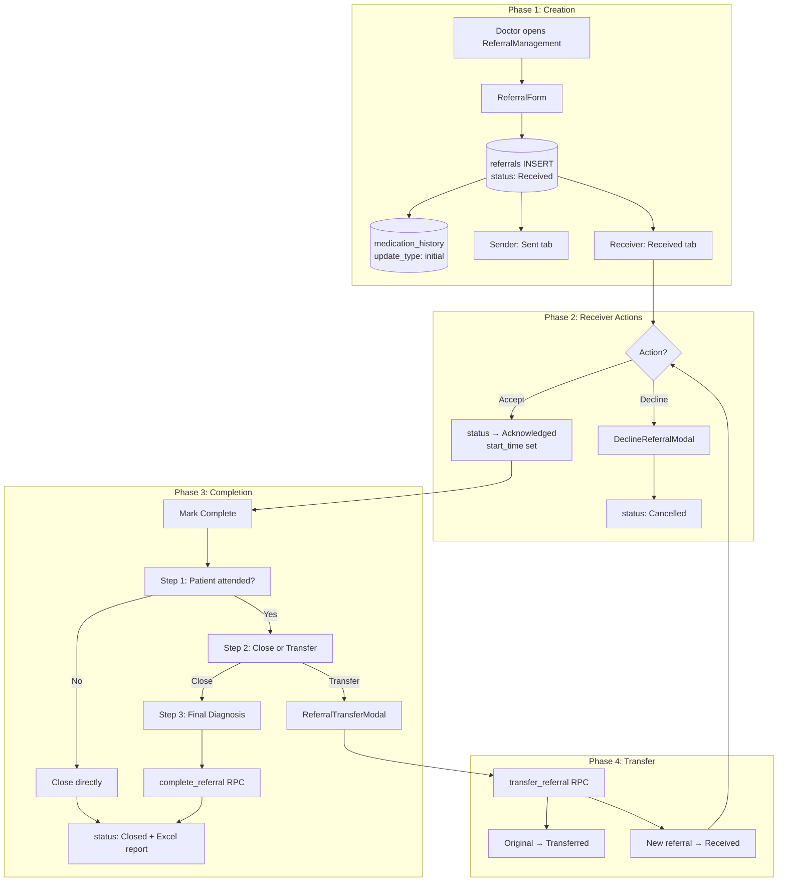
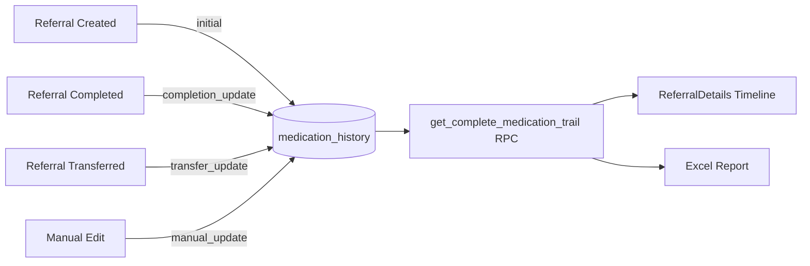
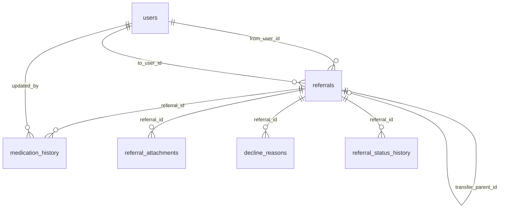

# MedSync 360 — Project Documentation

**Version:** 1.0.0  
**Last Updated:** June 14, 2026  
**Platform:** Medical referral management system for hospital departments

---

## Table of Contents

1. [Executive Summary](#1-executive-summary)
2. [Technology Stack](#2-technology-stack)
3. [Project Structure](#3-project-structure)
4. [Setup & Configuration](#4-setup--configuration)
5. [Application Modules](#5-application-modules)
6. [Referral System Overview](#6-referral-system-overview)
7. [Referral Lifecycle Flow](#7-referral-lifecycle-flow)
8. [Status Model](#8-status-model)
9. [Transfer System](#9-transfer-system)
10. [Medication History System](#10-medication-history-system)
11. [Database Schema](#11-database-schema)
12. [Backend Functions (RPC)](#12-backend-functions-rpc)
13. [Frontend Architecture](#13-frontend-architecture)
14. [Excel Reporting](#14-excel-reporting)
15. [Security & Compliance](#15-security--compliance)
16. [Troubleshooting](#16-troubleshooting)
17. [Related Documentation](#17-related-documentation)

---

## 1. Executive Summary

MedSync 360 is a React-based web application that enables hospital doctors to create, manage, transfer, and close patient referrals across medical departments. The platform provides:

- **Cross-department referral workflow** — send, receive, accept, decline, complete, or transfer referrals
- **Medication audit trail** — every medication change is timestamped and attributed to a doctor
- **Transfer chain tracking** — referrals can be forwarded between departments while preserving full history
- **Professional reporting** — Excel exports with complete medication journey and transfer history
- **HIPAA-oriented design** — encrypted data handling, role-based access, and audit logging

The referral system is the core feature of the application. All other modules (Dashboard, Research Insight, Messages, Video) support the clinical workflow around referrals.

---

## 2. Technology Stack

| Layer | Technology |
|-------|------------|
| **Frontend** | React 18, TypeScript, Vite 5 |
| **Routing** | React Router DOM 6 |
| **State** | Zustand (auth), TanStack React Query (server state) |
| **Styling** | Tailwind CSS, Framer Motion |
| **Forms** | React Hook Form |
| **Backend** | Supabase (PostgreSQL, Auth, Storage, Edge Functions) |
| **Encryption** | crypto-js (client-side HIPAA field encryption) |
| **Reporting** | xlsx (Excel export) |
| **AI** | OpenAI API (planned AI Assistant module) |
| **Monitoring** | Sentry (optional) |

---

## 3. Project Structure

```
medsync_newbuild/
├── src/
│   ├── App.tsx                          # Routes and auth guards
│   ├── components/
│   │   ├── features/
│   │   │   ├── referrals/               # Core referral module
│   │   │   │   ├── ReferralManagement.tsx
│   │   │   │   ├── ReferralForm.tsx
│   │   │   │   ├── ReferralCard.tsx
│   │   │   │   ├── ReferralDetails.tsx
│   │   │   │   ├── ReferralCompletionModal.tsx
│   │   │   │   ├── ReferralTransferModal.tsx
│   │   │   │   ├── DeclineReferralModal.tsx
│   │   │   │   └── ReferralTabs.tsx
│   │   │   ├── dashboard/
│   │   │   ├── research-insight/
│   │   │   ├── auth/
│   │   │   └── onboarding/
│   │   ├── layout/
│   │   └── ui/
│   ├── hooks/
│   │   ├── useReferrals.ts              # Referral CRUD, transfer, medication
│   │   └── useCompleteMedicationTrail.ts
│   ├── types/
│   │   └── referral.types.ts            # TypeScript interfaces
│   ├── utils/
│   │   └── excelExport.ts               # Report generation
│   ├── store/
│   │   └── authStore.ts
│   └── lib/
│       └── supabase.ts
├── supabase/
│   └── migrations/                      # Database schema & functions
├── docs/                                # Project documentation
├── scripts/                             # Utilities, seeders, troubleshooters
├── .env.example                         # Environment variable template
└── package.json
```

---

## 4. Setup & Configuration

### 4.1 Prerequisites

- Node.js 18+
- npm or yarn
- Supabase project (remote or local via Supabase CLI)

### 4.2 Installation

```bash
npm install
npm run dev        # Start development server (Vite)
npm run build      # Production build
npm run preview    # Preview production build
```

### 4.3 Environment Variables

Create a `.env` file in the project root (see `.env.example`):

| Variable | Purpose |
|----------|---------|
| `VITE_SUPABASE_URL` | Supabase project URL |
| `VITE_SUPABASE_ANON_KEY` | Supabase anonymous/public API key |
| `VITE_ENCRYPTION_KEY` | Client-side encryption key for HIPAA fields |
| `VITE_OPENAI_API_KEY` | OpenAI API key for AI Assistant |
| `VITE_APP_ENV` | Environment label (`development` / `production`) |
| `VITE_APP_VERSION` | Application version string |
| `VITE_SENTRY_DSN` | (Optional) Sentry error monitoring |
| `SUPABASE_SERVICE_ROLE_KEY` | (Scripts only) Admin operations |

### 4.4 Database Migrations

Apply Supabase migrations in order from `supabase/migrations/`. Key migrations for the referral system:

| Migration | Purpose |
|-----------|---------|
| `20250621174925_dark_sunset.sql` | Core `referrals` table |
| `20250628111623_mellow_grove.sql` | Auto-status trigger on creation |
| `20250726160000_create_medication_history.sql` | Medication history table |
| `20250727160000_add_referral_transfer_support.sql` | Transfer fields + `transfer_referral()` |
| `20250801200000_create_complete_referral_function.sql` | `complete_referral()` RPC |
| `20250804120000_create_complete_medication_trail_function.sql` | `get_complete_medication_trail()` |
| `20240812150000_add_decline_reasons_final_v2.sql` | Decline reasons table |

---

## 5. Application Modules

| Module | Route | Status | Description |
|--------|-------|--------|-------------|
| **Dashboard** | `/dashboard` | Active | Overview and quick actions |
| **Referrals** | `/referrals` | Active | Full referral management (core) |
| **Research Insight** | `/research-insight` | Active | Medical research data browser |
| **Messages** | `/messages` | Active | Internal messaging |
| **MedSync Video** | `/video` | Active | Video consultation |
| **AI Assistant** | `/ai-assistant` | Planned | AI-powered medical insights |
| **Analytics** | `/analytics` | Planned | Department analytics |
| **Settings** | `/settings` | Planned | User preferences |

### Authentication Flow

1. User logs in via `LoginForm` (Supabase Auth)
2. If profile incomplete → redirected to `OnboardingForm`
3. If profile complete → redirected to `/dashboard`
4. All referral routes require authenticated session with completed profile

---

## 6. Referral System Overview

The referral system manages the complete lifecycle of a patient referral between doctors and departments.

### 6.1 Core Concepts

| Concept | Description |
|---------|-------------|
| **Referral** | A patient case sent from one doctor/department to another |
| **Sender** | Doctor who creates the referral (`from_user_id`) |
| **Receiver** | Doctor who receives the referral (`to_user_id`) |
| **Transfer** | Forwarding a referral to a different doctor/department |
| **Transfer Chain** | Linked referrals via `transfer_parent_id` |
| **Medication Trail** | Chronological record of all medication changes across the chain |

### 6.2 UI Tabs (ReferralManagement)

| Tab | Shows | Filter Logic |
|-----|-------|--------------|
| **Received** | New referrals in inbox | `direction=received` AND `status=Received` |
| **Accepted** | Accepted referrals being worked on | `direction=received` AND `status=Accepted/Acknowledged` |
| **Sent** | Referrals the user created | `direction=sent` OR transferred referrals where user is receiver |
| **Closed** | Completed referrals | `status=Closed` |
| **Cancelled** | Declined referrals | `status=Cancelled` |
| **Archive** | All referrals (paginated) | No status filter |

---

## 7. Referral Lifecycle Flow

### 7.1 High-Level Flow Diagram



### 7.2 Phase 1 — Referral Creation

**Component:** `ReferralForm.tsx`  
**Handler:** `handleCreateReferral()` in `ReferralManagement.tsx`  
**Hook:** `useCreateReferral()` → `createReferral()` in `useReferrals.ts`

**Form fields captured:**

| Field | DB Column |
|-------|-----------|
| Patient Name | `patient_name` / `title` |
| Age | `patient_age` |
| Sex | `patient_sex` |
| Admission Date | `admission_date` |
| Admission Time | `patient_admission_time` |
| Room No | `room_no` |
| IP No | `patient_ip_no` |
| Chief Complaint | `description` |
| Past History | `past_history` |
| General Examination | `general_examination` |
| Medication Given | `medication_given` |
| Urgency | `urgency` (Emergency / Urgent / Normal / Elective) |
| Target Department | `to_department` |
| Target Doctor | `to_user_id` |
| Attachments | `attachments` + `referral_attachments` table |

**On insert:**
- `from_user_id` = current authenticated user
- `from_department` = current user's department (required)
- `status` = `Received` (set by DB trigger when `to_user_id` is assigned)
- DB trigger creates `medication_history` entry with `update_type: initial`

### 7.3 Phase 2 — Receiver Actions

#### Accept

- **UI action:** "Accept" button on `ReferralCard` or `ReferralDetails`
- **DB update:** `status` → `Acknowledged`, `start_time` set to now
- **UI display:** Receiver sees **Accepted** tab; sender still sees **Sent** tab

#### Decline

- **Component:** `DeclineReferralModal.tsx`
- **Records:** `decline_reasons` table (reason code + free text)
- **DB update:** `status` → `Cancelled`

### 7.4 Phase 3 — Completion Workflow

**Trigger:** "Mark as Completed" on an accepted referral  
**Component:** `ReferralCompletionModal.tsx` (3-step wizard)

#### Step 1 — Patient Attendance

| Answer | Required Input |
|--------|----------------|
| **Yes, Patient Attended** | Optional medication update |
| **No, Patient Not Attended** | Reasons why patient was not seen |

#### Step 2 — Action Selection

| Action | Next Step |
|--------|-----------|
| **Close Referral** | If attended → Step 3 (Diagnosis). If not attended → close immediately |
| **Transfer Referral** | Opens `ReferralTransferModal` |

#### Step 3 — Final Diagnosis (if patient attended)

| Field | Validation |
|-------|------------|
| Diagnosis Category | Required (dropdown: Complete Recovery, Partial Recovery, etc.) |
| Diagnosis Details | Required, max 2500 characters |

#### Close Path

```
ReferralCompletionModal
  → complete_referral RPC
    → medication_history INSERT (completion_update)
    → referrals UPDATE (status=Closed, end_time, medication_given)
  → Excel report generated (with complete medication trail)
```

#### Not-Attended Close Path

```
ReferralCompletionModal
  → updateStatusMutation (status=Closed)
  → No medication update, no Excel report
```

### 7.5 Phase 4 — Transfer Workflow

**Component:** `ReferralTransferModal.tsx`  
**Handler:** `handleTransferAction()` in `ReferralManagement.tsx`  
**Hook:** `useTransferReferral()` → `transfer_referral` RPC

**Transfer form fields:**

| Field | Purpose |
|-------|---------|
| Target Department | 47+ medical departments (excludes current) |
| Target Doctor | Loaded dynamically from `users` table |
| Transfer Reason | Why patient needs to move |
| Special Notes | Clinical findings and care instructions |
| Attachments | Additional files (images, PDFs, max 5MB each) |
| Updated Medication | Carried from completion modal |

**Database operations (atomic via `transfer_referral()`):**

1. Read original referral
2. INSERT new referral for target doctor (`status: Received`, `transfer_parent_id` set)
3. UPDATE original referral (`status: Transferred`, `transferred_at` set)
4. Copy attachments to new referral
5. Record medication history (`transfer_update`)

**Transfer chain example:**

```
Referral A (Dr. Smith → Dr. Jones)
  └── Referral B (Dr. Jones transfers → Dr. Patel)  [transfer_parent_id = A.id]
        └── Referral C (Dr. Patel closes)             [transfer_parent_id = B.id]
```

Query full chain: `get_referral_transfer_history(referral_id)`

---

## 8. Status Model

### 8.1 Database Statuses

```sql
referral_status ENUM: 'Sent' | 'Received' | 'Acknowledged' | 'Cancelled' | 'Closed' | 'Transferred'
referral_urgency ENUM: 'Normal' | 'Urgent' | 'Emergency' | 'Elective'
```

### 8.2 UI vs Database Mapping

The UI applies **perspective-based status mapping** in `useReferrals.ts`:

| DB Status | Sender Sees | Receiver Sees |
|-----------|-------------|---------------|
| `Received` | Sent | Received |
| `Acknowledged` | Sent | Accepted |
| `Transferred` | Sent (if they transferred) | Transferred |
| `Closed` | Closed | Closed |
| `Cancelled` | Cancelled | Cancelled |

**Mapping functions** (`referral.types.ts`):
- `mapStatusForDisplay()` — DB → UI
- `mapStatusForDatabase()` — UI `Accepted` → DB `Acknowledged`

### 8.3 Status Transition Table

| From | Action | To | Who |
|------|--------|----|-----|
| — | Create referral | `Received` | System (trigger) |
| `Received` | Accept | `Acknowledged` | Receiver |
| `Received` | Decline | `Cancelled` | Receiver |
| `Acknowledged` | Complete (close) | `Closed` | Receiver |
| `Acknowledged` | Complete (transfer) | `Transferred` + new `Received` | Receiver |
| `Acknowledged` | Close (not attended) | `Closed` | Receiver |

---

## 9. Transfer System

### 9.1 Transfer Fields on `referrals` Table

| Column | Type | Description |
|--------|------|-------------|
| `transfer_parent_id` | UUID | Links to the referral this was transferred from |
| `transfer_reason` | TEXT | Why the transfer was made |
| `transfer_notes` | TEXT | Clinical notes and instructions |
| `transferred_from_user_id` | UUID | Doctor who performed the transfer |
| `transferred_from_department` | TEXT | Department transferring from |
| `transferred_at` | TIMESTAMPTZ | When the transfer occurred |

### 9.2 Transfer Rules

- A referral can only be transferred from an **Accepted/Acknowledged** state
- The completion modal must be used first (attendance check required)
- Original referral status becomes `Transferred` (not `Closed`)
- New referral starts at `Received` for the target doctor
- `transfer_parent_id` must not equal the referral's own `id` (DB constraint)
- Transfer chain is queryable via `get_referral_transfer_history()`

### 9.3 Common Transfer Mistake

Selecting **"Close Referral"** instead of **"Transfer Referral"** in the completion modal will set status to `Closed` without creating a child referral. The correct path is:

```
Complete → Patient Attended → Transfer Referral → Transfer Modal → Submit
```

---

## 10. Medication History System

### 10.1 Overview

Every medication change throughout a referral's lifecycle is recorded in the `medication_history` table with full audit metadata. The **Complete Medication Journey** view aggregates all steps across the entire transfer chain.

### 10.2 `medication_history` Table

| Column | Type | Description |
|--------|------|-------------|
| `id` | UUID | Primary key |
| `referral_id` | UUID | FK → `referrals.id` |
| `medication_text` | TEXT | The medication information |
| `updated_by` | UUID | FK → `users.id` |
| `updated_at` | TIMESTAMPTZ | When the update occurred |
| `update_type` | TEXT | See types below |
| `notes` | TEXT | Optional context |
| `created_at` | TIMESTAMPTZ | Record creation time |

### 10.3 Update Types

| `update_type` | Trigger Event | Source |
|---------------|---------------|--------|
| `initial` | Referral created | DB trigger (`add_initial_medication_trigger`) |
| `completion_update` | Referral closed (patient attended) | `complete_referral()` RPC |
| `transfer_update` | Referral transferred | `transfer_referral()` + `useReferrals` hook |
| `manual_update` | Doctor manually edits medication | `useAddMedicationHistory()` |

### 10.4 Referral Medication Fields

| Column | Description |
|--------|-------------|
| `medication_given` | Current/latest medication text |
| `initial_medication` | Snapshot at referral creation |
| `last_medication_update` | Timestamp of most recent change |
| `medication_update_count` | Total number of updates (auto-maintained by trigger) |

### 10.5 Complete Medication Trail

**RPC:** `get_complete_medication_trail(p_referral_id UUID)`  
**Hook:** `useCompleteMedicationTrail(referralId)`  
**UI:** `ReferralDetails.tsx` — "Complete Medication Journey" timeline

**Action types returned:**

| Step | `action_type` | When |
|------|---------------|------|
| 1 | `Created Referral` | Original referral inserted |
| 2 | `Initial Medication Set` | First medication recorded |
| 3 | `Updated During Transfer` | Medication changed at transfer |
| 4 | `Received Transfer` | New doctor receives transferred case |
| 5 | `Completed Referral` | Final doctor closes case |

**Output fields per step:**

```typescript
interface CompleteMedicationTrail {
  step_number: number;
  record_timestamp: string;
  formatted_time: string;
  doctor_name: string;
  doctor_id: string;
  action_type: string;
  department_context: string;
  medication_prescribed: string;
  medication_context: string;
  referral_id: string;
  referral_title: string;
  is_original_referral: boolean;
}
```

### 10.6 Medication Flow Diagram



---

## 11. Database Schema

### 11.1 Core Tables

#### `referrals`

| Column | Type | Notes |
|--------|------|-------|
| `id` | UUID | PK |
| `title` | TEXT | Patient name |
| `description` | TEXT | Chief complaint |
| `urgency` | ENUM | Normal / Urgent / Emergency / Elective |
| `status` | ENUM | See status model |
| `from_user_id` | UUID | FK → users |
| `from_department` | TEXT | Sender's department |
| `to_user_id` | UUID | FK → users (nullable) |
| `to_department` | TEXT | Target department |
| `patient_name` | TEXT | Dedicated patient field |
| `patient_age` | INTEGER | |
| `patient_sex` | TEXT | Male / Female / Other |
| `admission_date` | DATE | |
| `patient_admission_time` | TEXT | |
| `room_no` | TEXT | |
| `patient_ip_no` | TEXT | |
| `past_history` | TEXT | |
| `general_examination` | TEXT | |
| `medication_given` | TEXT | Current medication |
| `initial_medication` | TEXT | Original medication |
| `last_medication_update` | TIMESTAMPTZ | |
| `medication_update_count` | INTEGER | |
| `start_time` | TIMESTAMPTZ | Set on accept |
| `end_time` | TIMESTAMPTZ | Set on close |
| `attachments` | TEXT[] | File URLs |
| `transfer_parent_id` | UUID | FK → referrals |
| `transfer_reason` | TEXT | |
| `transfer_notes` | TEXT | |
| `transferred_from_user_id` | UUID | |
| `transferred_from_department` | TEXT | |
| `transferred_at` | TIMESTAMPTZ | |
| `final_diagnosis_category` | TEXT | |
| `final_diagnosis_details` | TEXT | |
| `final_diagnosis_timestamp` | TIMESTAMPTZ | |
| `final_diagnosis_by` | UUID | |
| `created_at` | TIMESTAMPTZ | |
| `updated_at` | TIMESTAMPTZ | |

#### `medication_history`

See [Section 10.2](#102-medication_history-table).

#### `decline_reasons`

| Column | Type | Description |
|--------|------|-------------|
| `id` | UUID | PK |
| `referral_id` | UUID | FK → referrals |
| `reason_code` | TEXT | Structured reason code |
| `reason_text` | TEXT | Free-text explanation |
| `declined_by` | UUID | FK → users |
| `created_at` | TIMESTAMPTZ | |

#### `referral_attachments`

| Column | Type | Description |
|--------|------|-------------|
| `id` | UUID | PK |
| `referral_id` | UUID | FK → referrals |
| `file_name` | TEXT | Storage path |
| `original_file_name` | TEXT | Display name |
| `file_type` | TEXT | MIME type |
| `file_url` | TEXT | Public URL |
| `uploaded_by` | UUID | FK → users |

#### `referral_status_history`

Audit log of all status changes with `previous_status`, `new_status`, `changed_by`, `changed_at`.

### 11.2 Entity Relationship Diagram



---

## 12. Backend Functions (RPC)

| Function | Parameters | Returns | Purpose |
|----------|------------|---------|---------|
| `transfer_referral` | `p_original_referral_id`, `p_new_to_user_id`, `p_new_to_department`, `p_transfer_reason`, `p_transfer_notes`, `p_transferred_by_user_id` | UUID (new referral ID) | Atomic transfer operation |
| `complete_referral` | `p_referral_id`, `p_updated_medication`, `p_completed_by_user_id`, `p_final_diagnosis_category`, `p_final_diagnosis_details` | VOID | Close referral with medication + diagnosis |
| `get_complete_medication_trail` | `p_referral_id` | SETOF record | Full medication journey across transfer chain |
| `get_medication_timeline` | `p_referral_id` | SETOF record | Per-referral medication timeline |
| `get_referral_transfer_history` | `p_referral_id` | SETOF record | Full transfer chain |
| `fix_referral_categorization` | — | VOID | Corrects miscategorized referrals |
| `check_enum_value_exists` | `enum_name`, `enum_value` | BOOLEAN | Runtime enum validation |

### Parameter Name Contract

RPC parameter names in the frontend **must exactly match** the PostgreSQL function signatures. Mismatches cause silent failures.

```typescript
// Correct — matches DB function
await supabase.rpc('complete_referral', {
  p_referral_id: referralId,
  p_updated_medication: medication,
  p_completed_by_user_id: userId,
  p_final_diagnosis_category: category,
  p_final_diagnosis_details: details
});
```

---

## 13. Frontend Architecture

### 13.1 Component Hierarchy

```
ReferralManagement
├── ReferralTabs              # Tab navigation with counts
├── ReferralCard              # List item with quick actions
├── ReferralDetails           # Full referral view + medication journey
├── ReferralForm              # Create new referral
├── ReferralCompletionModal   # 3-step completion wizard
│   ├── Step 1: Attendance
│   ├── Step 2: Action (Close / Transfer)
│   └── Step 3: Diagnosis
├── ReferralTransferModal     # Department + doctor selection
└── DeclineReferralModal      # Decline with reason
```

### 13.2 Hooks

| Hook | File | Purpose |
|------|------|---------|
| `useReferrals()` | `useReferrals.ts` | Fetch all referrals for current user |
| `useCreateReferral()` | `useReferrals.ts` | Create new referral |
| `useUpdateReferralStatus()` | `useReferrals.ts` | Accept, close, cancel |
| `useTransferReferral()` | `useReferrals.ts` | Transfer to another doctor |
| `useAddMedicationHistory()` | `useReferrals.ts` | Manual medication entry |
| `useMedicationHistory()` | `useReferrals.ts` | Fetch history for one referral |
| `useCompleteMedicationTrail()` | `useCompleteMedicationTrail.ts` | Full journey across chain |
| `useTransferHistory()` | `useReferrals.ts` | Transfer chain for a referral |

### 13.3 Key TypeScript Types

Defined in `src/types/referral.types.ts`:

- `Referral` — main referral interface
- `ReferralStatus` — `'Sent' | 'Received' | 'Acknowledged' | 'Accepted' | 'Cancelled' | 'Closed' | 'Transferred'`
- `UrgencyLevel` — `'Emergency' | 'Urgent' | 'Normal' | 'Elective'`
- `MedicationHistory` — single medication history entry
- `MedicationUpdateType` — `'initial' | 'completion_update' | 'transfer_update' | 'manual_update'`
- `CompleteMedicationTrail` — unified journey step
- `TransferHistory` — transfer chain entry
- `CompletedReferralData` — Excel report input shape

### 13.4 Data Fetching Pattern

```typescript
// Referrals list — perspective-based status mapping applied in fetchReferrals()
const { data: referrals } = useReferrals();

// Medication trail — always fresh (staleTime: 0)
const { data: trail } = useCompleteMedicationTrail(referralId);

// Status update — invalidates referral list cache
updateStatusMutation.mutate({ id, status: 'Accepted' });
```

---

## 14. Excel Reporting

**File:** `src/utils/excelExport.ts`  
**Trigger:** Automatically on referral close (patient attended path)  
**Library:** `xlsx`

### 14.1 Report Sections

1. **Header** — MedSync 360 branding, generation timestamp
2. **Patient Information** — Name, age, sex, admission date, room, IP number
3. **Referral Details** — ID, complaint, urgency, status, departments
4. **Referral Path** — From/To department and doctor
5. **Medication Details** — Original vs updated medication
6. **Complete Medication Journey** — Full trail from `get_complete_medication_trail`
7. **Medication Trail Summary** — First vs final medication comparison
8. **Completion Information** — Attendance, diagnosis, completed by/at
9. **Transfer History** — Chain of transfers (if applicable)
10. **Timeline** — Duration analysis and timestamps
11. **Footer** — Confidentiality notice

### 14.2 File Naming

```
Referral_{PatientName}_{YYYY-MM-DD_HH-mm}.xlsx
```

### 14.3 Report Data Shape

```typescript
interface CompletedReferralData {
  referral: Referral;                          // With medication_history[]
  completionData: {
    isPatientAttended: boolean;
    updatedMedication?: string;
    reasons?: string;
    completedAt: string;
    completedBy: string;
    finalDiagnosisCategory?: string;
    finalDiagnosisDetails?: string;
  };
  transferHistory: TransferHistory[];
  completeMedicationTrail: CompleteMedicationTrail[];
}
```

---

## 15. Security & Compliance

### 15.1 Authentication

- Supabase Auth with email/password
- JWT-based session management
- Profile completion gate before accessing referral features

### 15.2 Row-Level Security (RLS)

All tables have RLS enabled. Key policies:

- Users can read referrals they **sent** or **received**
- Users can read referrals sent to their **department**
- Users can only **create** referrals as themselves (`from_user_id = auth.uid()`)
- Medication history visible only for referrals in user's department

### 15.3 Data Protection

- Client-side encryption for sensitive fields (`VITE_ENCRYPTION_KEY`)
- All API calls over HTTPS
- File uploads validated (type + 5MB size limit)
- Supabase Storage with access-controlled buckets

### 15.4 Audit Trail

- `medication_history` — every medication change
- `referral_status_history` — every status change
- `decline_reasons` — every decline with reason
- Transfer fields — full chain preserved on `referrals` table

---

## 16. Troubleshooting

### Referral not appearing in correct tab

- Check `from_user_id` / `to_user_id` assignment
- Verify perspective-based status mapping in `fetchReferrals()`
- Run `fix_referral_categorization` RPC

### Transfer created Closed instead of Transferred

- User selected "Close Referral" instead of "Transfer Referral" in completion modal
- Correct path: Complete → Attended → **Transfer Referral** → Transfer Modal

### Medication trail empty in UI

```sql
-- Verify backend returns data
SELECT * FROM get_complete_medication_trail('<referral_uuid>');
```

- Check `CompleteMedicationTrail` TypeScript interface matches SQL output
- Ensure `record_timestamp` field name (not `timestamp`)
- Clear Vite cache: delete `node_modules/.vite`, hard refresh

### Excel report not downloading

- Check browser download permissions
- Verify `completeMedicationTrail` data is fetched before generation
- Check console for `generateReferralExcelReport` errors

### RPC function call fails

- Verify parameter names match DB function exactly (`p_referral_id`, not `referral_id`)
- Check Supabase logs for function errors
- Ensure user has authenticated session

---

## 17. Related Documentation

| Document | Location | Topic |
|----------|----------|-------|
| Complete Medication Journey | `docs/COMPLETE_MEDICATION_JOURNEY.md` | Medication trail architecture |
| Referral Completion Workflow | `scripts/Docs/REFERRAL_COMPLETION_WORKFLOW_GUIDE.md` | Completion modal details |
| Transfer System | `scripts/Docs/REFERRAL_TRANSFER_DETAILED_EXPLANATION.md` | Transfer workflow |
| Medication History | `scripts/Docs/MEDICATION_HISTORY_TRACKING_GUIDE.md` | DB schema and hooks |
| Data Integrity | `scripts/Docs/REFERRAL_DATA_INTEGRITY_GUIDE.md` | Data consistency rules |
| Observability | `docs/OBSERVABILITY.md` | Logging and monitoring |
| Interactive Flow Diagram | `.cursor/projects/.../canvases/referral-medication-flow.canvas.tsx` | Visual flow diagram |

---

## Appendix A — Quick Reference: End-to-End User Journey

```
1. Dr. Smith creates referral for patient "John Doe"
   → medication_given: "Paracetamol 500mg"
   → medication_history: initial entry created
   → Dr. Jones sees it in Received tab

2. Dr. Jones accepts referral
   → status: Acknowledged (UI: Accepted)
   → start_time recorded

3. Dr. Jones sees patient, updates medication
   → medication_given: "Paracetamol + Amoxicillin"
   → Chooses "Transfer Referral"
   → Selects Cardiology, Dr. Patel
   → transfer_referral RPC runs
   → Original: Transferred | New referral: Received for Dr. Patel
   → medication_history: transfer_update entry

4. Dr. Patel accepts, treats patient, closes
   → Final diagnosis: "Complete Recovery"
   → complete_referral RPC runs
   → medication_history: completion_update entry
   → status: Closed
   → Excel report downloaded with 5-step medication journey

5. Anyone viewing ReferralDetails sees:
   → Complete Medication Journey timeline (all 5 steps)
   → Transfer history chain
   → Original vs final medication summary
```

---

## Appendix B — Glossary

| Term | Definition |
|------|------------|
| **Referral** | A formal request to transfer patient care to another department/doctor |
| **Transfer** | Forwarding an active referral to a different doctor while preserving history |
| **Transfer Chain** | Sequence of linked referrals via `transfer_parent_id` |
| **Medication Trail** | Chronological audit of all medication changes for a referral |
| **Acknowledged** | Database status meaning the receiver has accepted the referral |
| **Accepted** | UI label for `Acknowledged` status (receiver perspective) |
| **Complete Medication Journey** | Unified view of medication actions across the entire transfer chain |
| **RLS** | Row-Level Security — Supabase/PostgreSQL access control per row |
| **RPC** | Remote Procedure Call — Supabase PostgreSQL function called from frontend |

---

*This document is the authoritative reference for the MedSync 360 referral and medication history system. Update it whenever schema, RPC signatures, or UI workflow changes.*
