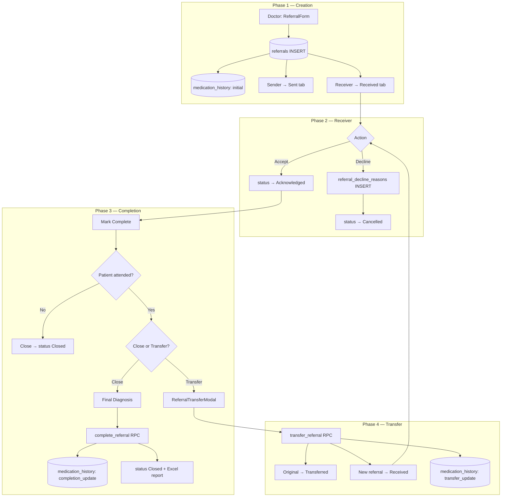
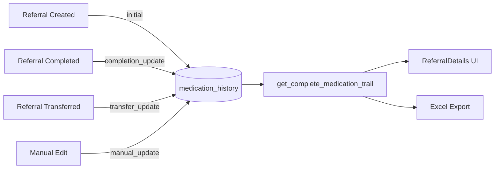
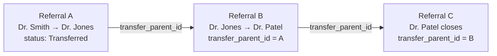
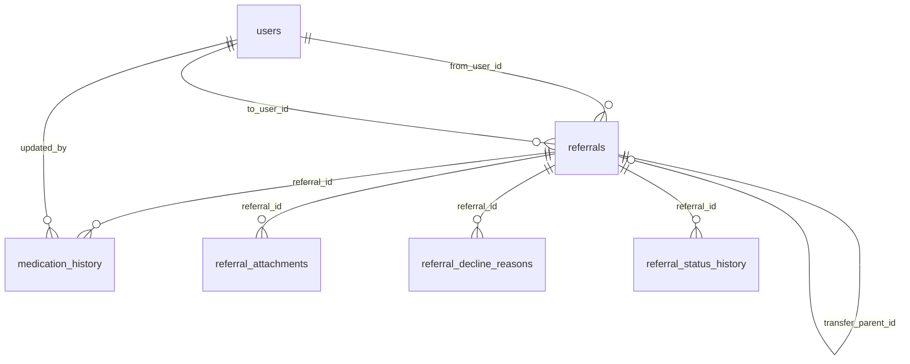

# Referral & Medication Journey — Technical Reference

**MedSync 360** | Focused documentation for the referral lifecycle and medication history system.

---

## Table of Contents

1. [Overview](#1-overview)
2. [Flow Diagrams](#2-flow-diagrams)
3. [Database Tables](#3-database-tables)
4. [Medication Journey](#4-medication-journey)
5. [Status Reference](#5-status-reference)
6. [Verify Database (Check What's Missing)](#6-verify-database-check-whats-missing)
7. [Create / Fix Missing Database Objects](#7-create--fix-missing-database-objects)
8. [Test & Debug Queries](#8-test--debug-queries)
9. [Source Files](#9-source-files)

---

## 1. Overview

The referral system tracks a patient case from creation through acceptance, optional transfers, and closure. Every medication change is recorded in `medication_history` and can be viewed as a **Complete Medication Journey** across the full transfer chain.

### Key concepts

| Term | Meaning |
|------|---------|
| **Referral** | Patient case sent from one doctor to another |
| **Transfer chain** | Linked referrals via `transfer_parent_id` |
| **Medication trail** | Chronological audit of all medication changes |
| **Complete Medication Journey** | Unified timeline across original + all transferred referrals |

### Lifecycle at a glance

```
Create → Received → Accept → Complete (Close or Transfer) → Closed / Transferred
                                    ↓
                          medication_history updated at each step
```

---

## 2. Flow Diagrams

### 2.1 Referral Lifecycle



### 2.2 Medication Journey



### 2.3 Transfer Chain (Data Model)



### 2.4 Entity Relationship



---

## 3. Database Tables

### 3.1 `referrals` (core table)

| Column | Type | Description |
|--------|------|-------------|
| `id` | UUID | Primary key |
| `title` | TEXT | Patient name |
| `description` | TEXT | Chief complaint |
| `urgency` | ENUM | `Normal`, `Urgent`, `Emergency`, `Elective` |
| `status` | ENUM | See [Status Reference](#5-status-reference) |
| `from_user_id` | UUID | Referring doctor |
| `from_department` | TEXT | Sender department |
| `to_user_id` | UUID | Receiving doctor |
| `to_department` | TEXT | Target department |
| `patient_name` | TEXT | Patient name |
| `patient_age` | INTEGER | Patient age |
| `patient_sex` | TEXT | `Male` / `Female` / `Other` |
| `admission_date` | DATE | Admission date |
| `patient_admission_time` | TIME | Admission time |
| `room_no` | VARCHAR | Room number |
| `patient_ip_no` | VARCHAR | Inpatient number |
| `past_history` | TEXT | Medical past history |
| `general_examination` | TEXT | Examination findings |
| `medication_given` | TEXT | **Current** medication |
| `initial_medication` | TEXT | Medication at creation |
| `last_medication_update` | TIMESTAMPTZ | Last change timestamp |
| `medication_update_count` | INTEGER | Total updates |
| `start_time` | TIMESTAMPTZ | Set when accepted |
| `end_time` | TIMESTAMPTZ | Set when closed |
| `attachments` | TEXT[] | File URL array |
| `transfer_parent_id` | UUID | FK → parent referral |
| `transfer_reason` | TEXT | Why transferred |
| `transfer_notes` | TEXT | Clinical notes |
| `transferred_from_user_id` | UUID | Doctor who transferred |
| `transferred_from_department` | TEXT | Department transferring from |
| `transferred_at` | TIMESTAMPTZ | Transfer timestamp |
| `decline_reason_id` | UUID | FK → decline record |
| `final_diagnosis_category` | TEXT | Diagnosis category on close |
| `final_diagnosis_details` | TEXT | Diagnosis details on close |
| `final_diagnosis_timestamp` | TIMESTAMPTZ | When diagnosis recorded |
| `final_diagnosis_by` | UUID | Doctor who recorded diagnosis |
| `created_at` | TIMESTAMPTZ | Created |
| `updated_at` | TIMESTAMPTZ | Last updated |

### 3.2 `medication_history`

| Column | Type | Description |
|--------|------|-------------|
| `id` | UUID | Primary key |
| `referral_id` | UUID | FK → `referrals.id` |
| `medication_text` | TEXT | Medication content |
| `updated_by` | UUID | FK → `users.id` |
| `updated_at` | TIMESTAMPTZ | When updated |
| `update_type` | TEXT | `initial` \| `completion_update` \| `transfer_update` \| `manual_update` |
| `notes` | TEXT | Optional context |
| `created_at` | TIMESTAMPTZ | Record created |

**Auto-maintained on `referrals`:**
- `last_medication_update` and `medication_update_count` updated by trigger `trigger_update_medication_tracking`

### 3.3 `referral_decline_reasons`

| Column | Type | Description |
|--------|------|-------------|
| `id` | UUID | Primary key |
| `referral_id` | UUID | FK → `referrals.id` |
| `reason_code` | TEXT | e.g. `incorrect_details`, `not_needed`, `not_on_duty` |
| `reason_text` | TEXT | Free-text (required for "other") |
| `declined_by` | UUID | FK → `users.id` |
| `declined_at` | TIMESTAMPTZ | When declined |

### 3.4 `referral_attachments`

| Column | Type | Description |
|--------|------|-------------|
| `id` | UUID | Primary key |
| `referral_id` | UUID | FK → `referrals.id` |
| `file_name` | TEXT | Storage path |
| `original_file_name` | TEXT | Display name |
| `file_type` | TEXT | MIME type |
| `file_url` | TEXT | Public URL |
| `uploaded_by` | UUID | FK → `users.id` |
| `created_at` | TIMESTAMPTZ | Upload time |

### 3.5 `referral_status_history`

| Column | Type | Description |
|--------|------|-------------|
| `id` | UUID | Primary key |
| `referral_id` | UUID | FK → `referrals.id` |
| `previous_status` | ENUM | Status before change |
| `new_status` | ENUM | Status after change |
| `changed_by` | UUID | FK → `users.id` |
| `changed_at` | TIMESTAMPTZ | When changed |
| `reason` | TEXT | Optional reason |

### 3.6 Enums

```sql
referral_status:  'Sent' | 'Received' | 'Acknowledged' | 'Cancelled' | 'Closed' | 'Transferred'
referral_urgency: 'Normal' | 'Urgent' | 'Emergency' | 'Elective'
```

---

## 4. Medication Journey

### 4.1 When medication is recorded

| Event | `update_type` | Triggered by |
|-------|---------------|--------------|
| Referral created | `initial` | DB trigger `trigger_record_initial_medication` |
| Referral closed (attended) | `completion_update` | `complete_referral()` RPC |
| Referral transferred | `transfer_update` | `transfer_referral()` RPC |
| Doctor manual edit | `manual_update` | `useAddMedicationHistory()` |

### 4.2 Complete Medication Trail — action types

RPC: `get_complete_medication_trail(p_referral_id)`

| Step | `action_type` | When |
|------|---------------|------|
| 1 | `Created Referral` | Original referral created |
| 2 | `Initial Medication Set` | First medication in history |
| 3 | `Updated During Transfer` | Medication changed at transfer |
| 4 | `Received Transfer` | New doctor receives transferred case |
| 5 | `Completed Referral` | Final doctor closes case |

### 4.3 Frontend display

- **Component:** `ReferralDetails.tsx` → "Complete Medication Journey" timeline
- **Hook:** `useCompleteMedicationTrail(referralId)`
- **Export:** `excelExport.ts` → "COMPLETE MEDICATION JOURNEY" section

---

## 5. Status Reference

| DB Status | Receiver sees | Sender sees | Set when |
|-----------|---------------|-------------|----------|
| `Received` | Received | Sent | Referral created / transferred to new doctor |
| `Acknowledged` | Accepted | Sent | Receiver clicks Accept |
| `Transferred` | — | Sent | Receiver transfers to another doctor |
| `Closed` | Closed | Closed | Referral completed |
| `Cancelled` | Cancelled | Cancelled | Receiver declines |

> UI maps `Acknowledged` → `Accepted` for the receiver. Parameter names in RPC calls must match the database function exactly.

---

## 6. Verify Database (Check What's Missing)

Run these in the **Supabase SQL Editor** to audit your database.

### 6.1 Check required tables exist

```sql
SELECT table_name
FROM information_schema.tables
WHERE table_schema = 'public'
  AND table_name IN (
    'referrals',
    'medication_history',
    'referral_decline_reasons',
    'referral_attachments',
    'referral_status_history',
    'users'
  )
ORDER BY table_name;
-- Expected: 6 rows
```

### 6.2 Check required columns on `referrals`

```sql
SELECT column_name, data_type
FROM information_schema.columns
WHERE table_name = 'referrals'
  AND column_name IN (
    'medication_given', 'initial_medication',
    'last_medication_update', 'medication_update_count',
    'transfer_parent_id', 'transfer_reason', 'transfer_notes',
    'transferred_from_user_id', 'transferred_from_department', 'transferred_at',
    'from_department', 'patient_name', 'patient_age', 'patient_sex',
    'final_diagnosis_category', 'final_diagnosis_details',
    'start_time', 'end_time', 'decline_reason_id'
  )
ORDER BY column_name;
```

### 6.3 Check enum values

```sql
SELECT e.enumlabel AS status_value
FROM pg_type t
JOIN pg_enum e ON t.oid = e.enumtypid
WHERE t.typname = 'referral_status'
ORDER BY e.enumsortorder;
-- Expected: Sent, Received, Acknowledged, Cancelled, Closed, Transferred
```

### 6.4 Check required functions exist

```sql
SELECT routine_name, routine_type
FROM information_schema.routines
WHERE routine_schema = 'public'
  AND routine_name IN (
    'transfer_referral',
    'complete_referral',
    'get_complete_medication_trail',
    'get_referral_transfer_history',
    'get_medication_timeline',
    'record_initial_medication'
  )
ORDER BY routine_name;
```

### 6.5 Check required triggers exist

```sql
SELECT trigger_name, event_object_table, action_timing, event_manipulation
FROM information_schema.triggers
WHERE trigger_schema = 'public'
  AND trigger_name IN (
    'trigger_record_initial_medication',
    'trigger_update_medication_tracking',
    'update_referral_status_trigger'
  )
ORDER BY trigger_name;
```

### 6.6 Quick health check on a referral

```sql
-- Replace with a real referral UUID
SELECT
  r.id,
  r.patient_name,
  r.status,
  r.medication_given,
  r.initial_medication,
  r.medication_update_count,
  (SELECT COUNT(*) FROM medication_history mh WHERE mh.referral_id = r.id) AS history_rows,
  r.transfer_parent_id
FROM referrals r
WHERE r.id = '<REFERRAL_UUID>';
```

---

## 7. Create / Fix Missing Database Objects

Run in **Supabase SQL Editor** in order. Each block is idempotent (`IF NOT EXISTS` / `CREATE OR REPLACE`).

> **Tip:** If a step fails, fix that error before continuing. Full migration files are in `supabase/migrations/`.

---

### Step 1 — Medication columns on `referrals`

```sql
ALTER TABLE referrals
ADD COLUMN IF NOT EXISTS medication_given TEXT,
ADD COLUMN IF NOT EXISTS initial_medication TEXT,
ADD COLUMN IF NOT EXISTS last_medication_update TIMESTAMPTZ,
ADD COLUMN IF NOT EXISTS medication_update_count INTEGER DEFAULT 0,
ADD COLUMN IF NOT EXISTS start_time TIMESTAMPTZ,
ADD COLUMN IF NOT EXISTS end_time TIMESTAMPTZ;

-- Backfill initial_medication from medication_given where missing
UPDATE referrals
SET initial_medication = medication_given
WHERE initial_medication IS NULL
  AND medication_given IS NOT NULL
  AND medication_given != '';
```

### Step 2 — Patient detail columns

```sql
ALTER TABLE referrals
ADD COLUMN IF NOT EXISTS patient_name TEXT,
ADD COLUMN IF NOT EXISTS patient_age INTEGER,
ADD COLUMN IF NOT EXISTS patient_sex TEXT,
ADD COLUMN IF NOT EXISTS admission_date DATE,
ADD COLUMN IF NOT EXISTS patient_admission_time TIME,
ADD COLUMN IF NOT EXISTS room_no VARCHAR(50),
ADD COLUMN IF NOT EXISTS patient_ip_no VARCHAR(100),
ADD COLUMN IF NOT EXISTS past_history TEXT,
ADD COLUMN IF NOT EXISTS general_examination TEXT,
ADD COLUMN IF NOT EXISTS from_department TEXT;
```

### Step 3 — Transfer columns

```sql
ALTER TABLE referrals
ADD COLUMN IF NOT EXISTS transfer_parent_id UUID REFERENCES referrals(id),
ADD COLUMN IF NOT EXISTS transfer_reason TEXT,
ADD COLUMN IF NOT EXISTS transfer_notes TEXT,
ADD COLUMN IF NOT EXISTS transferred_from_user_id UUID REFERENCES users(id),
ADD COLUMN IF NOT EXISTS transferred_from_department TEXT,
ADD COLUMN IF NOT EXISTS transferred_at TIMESTAMPTZ;

-- Add Transferred status to enum if missing
DO $$
BEGIN
  IF NOT EXISTS (
    SELECT 1 FROM pg_enum
    WHERE enumlabel = 'Transferred'
    AND enumtypid = (SELECT oid FROM pg_type WHERE typname = 'referral_status')
  ) THEN
    ALTER TYPE referral_status ADD VALUE 'Transferred';
  END IF;
END $$;

-- Add Closed status if missing
DO $$
BEGIN
  IF NOT EXISTS (
    SELECT 1 FROM pg_enum
    WHERE enumlabel = 'Closed'
    AND enumtypid = (SELECT oid FROM pg_type WHERE typname = 'referral_status')
  ) THEN
    ALTER TYPE referral_status ADD VALUE 'Closed';
  END IF;
END $$;

CREATE INDEX IF NOT EXISTS idx_referrals_transfer_parent_id ON referrals(transfer_parent_id);
CREATE INDEX IF NOT EXISTS idx_referrals_transferred_at ON referrals(transferred_at);
```

### Step 4 — Diagnosis columns

```sql
ALTER TABLE referrals
ADD COLUMN IF NOT EXISTS final_diagnosis_category TEXT,
ADD COLUMN IF NOT EXISTS final_diagnosis_details TEXT,
ADD COLUMN IF NOT EXISTS final_diagnosis_timestamp TIMESTAMPTZ,
ADD COLUMN IF NOT EXISTS final_diagnosis_by UUID REFERENCES users(id),
ADD COLUMN IF NOT EXISTS decline_reason_id UUID;
```

### Step 5 — `medication_history` table

```sql
CREATE TABLE IF NOT EXISTS medication_history (
  id UUID PRIMARY KEY DEFAULT gen_random_uuid(),
  referral_id UUID NOT NULL REFERENCES referrals(id) ON DELETE CASCADE,
  medication_text TEXT NOT NULL,
  updated_by UUID REFERENCES users(id) ON DELETE SET NULL,
  updated_at TIMESTAMPTZ DEFAULT now() NOT NULL,
  update_type TEXT NOT NULL
    CHECK (update_type IN ('initial', 'completion_update', 'transfer_update', 'manual_update')),
  notes TEXT,
  created_at TIMESTAMPTZ DEFAULT now() NOT NULL
);

CREATE INDEX IF NOT EXISTS medication_history_referral_id_idx ON medication_history(referral_id);
CREATE INDEX IF NOT EXISTS medication_history_updated_at_idx ON medication_history(updated_at);

ALTER TABLE medication_history ENABLE ROW LEVEL SECURITY;
```

### Step 6 — Medication tracking trigger

```sql
CREATE OR REPLACE FUNCTION update_referral_medication_tracking()
RETURNS TRIGGER AS $$
BEGIN
  UPDATE referrals
  SET
    last_medication_update = NEW.updated_at,
    medication_update_count = (
      SELECT COUNT(*) FROM medication_history WHERE referral_id = NEW.referral_id
    )
  WHERE id = NEW.referral_id;
  RETURN NEW;
END;
$$ LANGUAGE plpgsql;

DROP TRIGGER IF EXISTS trigger_update_medication_tracking ON medication_history;
CREATE TRIGGER trigger_update_medication_tracking
  AFTER INSERT ON medication_history
  FOR EACH ROW
  EXECUTE FUNCTION update_referral_medication_tracking();
```

### Step 7 — Initial medication trigger (on referral create)

```sql
CREATE OR REPLACE FUNCTION record_initial_medication()
RETURNS TRIGGER AS $$
BEGIN
  IF NEW.medication_given IS NOT NULL AND NEW.medication_given != '' THEN
    INSERT INTO medication_history (
      referral_id, medication_text, update_type, updated_by, updated_at, notes
    ) VALUES (
      NEW.id, NEW.medication_given, 'initial', NEW.from_user_id, NEW.created_at,
      'Initial medication at referral creation'
    );
    -- Set initial_medication snapshot
    NEW.initial_medication := NEW.medication_given;
  END IF;
  RETURN NEW;
END;
$$ LANGUAGE plpgsql;

DROP TRIGGER IF EXISTS trigger_record_initial_medication ON referrals;
CREATE TRIGGER trigger_record_initial_medication
  AFTER INSERT ON referrals
  FOR EACH ROW
  EXECUTE FUNCTION record_initial_medication();

-- Backfill missing initial history for existing referrals
INSERT INTO medication_history (referral_id, medication_text, update_type, updated_at, updated_by, notes)
SELECT r.id, r.medication_given, 'initial', r.created_at, r.from_user_id,
       'Initial medication (retroactively added)'
FROM referrals r
WHERE r.medication_given IS NOT NULL AND r.medication_given != ''
  AND NOT EXISTS (
    SELECT 1 FROM medication_history mh
    WHERE mh.referral_id = r.id AND mh.update_type = 'initial'
  );
```

### Step 8 — `complete_referral` function (with diagnosis)

```sql
DROP FUNCTION IF EXISTS complete_referral(UUID, TEXT, UUID);
DROP FUNCTION IF EXISTS complete_referral(UUID, TEXT, UUID, TEXT, TEXT);

CREATE OR REPLACE FUNCTION complete_referral(
  p_referral_id UUID,
  p_updated_medication TEXT,
  p_completed_by_user_id UUID,
  p_final_diagnosis_category TEXT DEFAULT NULL,
  p_final_diagnosis_details TEXT DEFAULT NULL
)
RETURNS VOID AS $$
BEGIN
  INSERT INTO medication_history (referral_id, medication_text, update_type, updated_by)
  VALUES (p_referral_id, p_updated_medication, 'completion_update', p_completed_by_user_id);

  UPDATE referrals
  SET
    status = 'Closed',
    medication_given = p_updated_medication,
    end_time = NOW(),
    last_medication_update = NOW(),
    medication_update_count = (SELECT COUNT(*) FROM medication_history WHERE referral_id = p_referral_id),
    final_diagnosis_category = p_final_diagnosis_category,
    final_diagnosis_details = p_final_diagnosis_details,
    final_diagnosis_timestamp = CASE
      WHEN p_final_diagnosis_category IS NOT NULL OR p_final_diagnosis_details IS NOT NULL
      THEN NOW() ELSE NULL END,
    final_diagnosis_by = CASE
      WHEN p_final_diagnosis_category IS NOT NULL OR p_final_diagnosis_details IS NOT NULL
      THEN p_completed_by_user_id ELSE NULL END
  WHERE id = p_referral_id;
END;
$$ LANGUAGE plpgsql SECURITY DEFINER;
```

### Step 9 — `transfer_referral` function (latest version)

```sql
DROP FUNCTION IF EXISTS transfer_referral(UUID, UUID, TEXT, TEXT, TEXT, UUID);
DROP FUNCTION IF EXISTS transfer_referral(UUID, UUID, TEXT, TEXT, TEXT, UUID, TEXT);

CREATE OR REPLACE FUNCTION transfer_referral(
  p_original_referral_id UUID,
  p_new_to_user_id UUID,
  p_new_to_department TEXT,
  p_transfer_reason TEXT DEFAULT NULL,
  p_transfer_notes TEXT DEFAULT NULL,
  p_transferred_by_user_id UUID DEFAULT NULL,
  p_updated_medication_on_transfer TEXT DEFAULT NULL
)
RETURNS UUID AS $$
DECLARE
  source_ref referrals%ROWTYPE;
  new_ref_id UUID;
  from_dept TEXT;
BEGIN
  SELECT * INTO source_ref FROM referrals WHERE id = p_original_referral_id;
  IF NOT FOUND THEN RAISE EXCEPTION 'Referral not found'; END IF;

  SELECT department INTO from_dept FROM users WHERE id = p_transferred_by_user_id;
  new_ref_id := gen_random_uuid();

  INSERT INTO referrals (
    id, title, description, urgency, status, from_user_id, to_department, to_user_id,
    patient_name, patient_age, patient_sex, admission_date, patient_admission_time,
    room_no, patient_ip_no, past_history, general_examination,
    medication_given, initial_medication, attachments,
    transfer_parent_id, transfer_reason, transfer_notes,
    transferred_from_user_id, transferred_from_department, transferred_at, from_department
  ) VALUES (
    new_ref_id, source_ref.title, source_ref.description, source_ref.urgency, 'Received',
    p_transferred_by_user_id, p_new_to_department, p_new_to_user_id,
    source_ref.patient_name, source_ref.patient_age, source_ref.patient_sex,
    source_ref.admission_date, source_ref.patient_admission_time,
    source_ref.room_no, source_ref.patient_ip_no, source_ref.past_history, source_ref.general_examination,
    COALESCE(p_updated_medication_on_transfer, source_ref.medication_given),
    source_ref.initial_medication, source_ref.attachments,
    p_original_referral_id, p_transfer_reason, p_transfer_notes,
    p_transferred_by_user_id, from_dept, NOW(), from_dept
  );

  UPDATE referrals
  SET status = 'Transferred', updated_at = NOW(), transferred_at = NOW()
  WHERE id = p_original_referral_id;

  IF p_updated_medication_on_transfer IS NOT NULL THEN
    INSERT INTO medication_history (referral_id, medication_text, update_type, updated_by, notes)
    VALUES (p_original_referral_id, p_updated_medication_on_transfer, 'transfer_update',
            p_transferred_by_user_id, 'Medication updated during transfer.');
  END IF;

  RETURN new_ref_id;
END;
$$ LANGUAGE plpgsql SECURITY DEFINER;
```

### Step 10 — `get_complete_medication_trail` function

> This is the canonical version. Full SQL is in:
> `supabase/migrations/20240812120000_fix_complete_medication_trail_function.sql`

Run that migration file in the SQL Editor, or verify it exists:

```sql
SELECT routine_name FROM information_schema.routines
WHERE routine_name = 'get_complete_medication_trail' AND routine_schema = 'public';
```

### Step 11 — `get_referral_transfer_history` function

> Full SQL is in:
> `supabase/migrations/20250801220000_fix_transfer_history_function.sql`

```sql
SELECT routine_name FROM information_schema.routines
WHERE routine_name = 'get_referral_transfer_history' AND routine_schema = 'public';
```

### Step 12 — `get_medication_timeline` (may be missing)

The frontend calls this for Excel reports. Create if missing:

```sql
CREATE OR REPLACE FUNCTION get_medication_timeline(p_referral_id UUID)
RETURNS TABLE (
  update_order INTEGER,
  medication_text TEXT,
  update_type TEXT,
  notes TEXT,
  updated_by_name TEXT,
  updated_at TIMESTAMPTZ,
  previous_medication TEXT
) AS $$
BEGIN
  RETURN QUERY
  SELECT
    ROW_NUMBER() OVER (ORDER BY mh.updated_at ASC)::INTEGER AS update_order,
    mh.medication_text,
    mh.update_type,
    mh.notes,
    COALESCE(u.full_name, 'Unknown') AS updated_by_name,
    mh.updated_at,
    LAG(mh.medication_text) OVER (ORDER BY mh.updated_at ASC) AS previous_medication
  FROM medication_history mh
  LEFT JOIN users u ON mh.updated_by = u.id
  WHERE mh.referral_id = p_referral_id
  ORDER BY mh.updated_at ASC;
END;
$$ LANGUAGE plpgsql SECURITY DEFINER;
```

### Step 13 — Decline reasons table

```sql
CREATE TABLE IF NOT EXISTS referral_decline_reasons (
  id UUID PRIMARY KEY DEFAULT gen_random_uuid(),
  referral_id UUID NOT NULL REFERENCES referrals(id) ON DELETE CASCADE,
  reason_code TEXT NOT NULL,
  reason_text TEXT,
  declined_by UUID NOT NULL REFERENCES users(id),
  declined_at TIMESTAMPTZ DEFAULT now()
);

CREATE INDEX IF NOT EXISTS idx_referral_decline_reasons_referral_id
  ON referral_decline_reasons(referral_id);

ALTER TABLE referrals
ADD COLUMN IF NOT EXISTS decline_reason_id UUID REFERENCES referral_decline_reasons(id);

ALTER TABLE referral_decline_reasons ENABLE ROW LEVEL SECURITY;
```

---

## 8. Test & Debug Queries

Replace `<REFERRAL_UUID>` with a real referral ID.

### 8.1 View medication history for one referral

```sql
SELECT
  mh.update_type,
  mh.medication_text,
  mh.updated_at,
  u.full_name AS updated_by,
  mh.notes
FROM medication_history mh
LEFT JOIN users u ON mh.updated_by = u.id
WHERE mh.referral_id = '<REFERRAL_UUID>'
ORDER BY mh.updated_at ASC;
```

### 8.2 View complete medication journey (across transfer chain)

```sql
SELECT * FROM get_complete_medication_trail('<REFERRAL_UUID>');
```

### 8.3 View transfer chain

```sql
SELECT * FROM get_referral_transfer_history('<REFERRAL_UUID>');
```

### 8.4 View medication timeline (for Excel)

```sql
SELECT * FROM get_medication_timeline('<REFERRAL_UUID>');
```

### 8.5 Check data consistency

```sql
SELECT
  r.id,
  r.patient_name,
  r.status,
  r.medication_given AS current_medication,
  r.initial_medication,
  r.medication_update_count,
  (SELECT COUNT(*) FROM medication_history mh WHERE mh.referral_id = r.id) AS history_count,
  CASE
    WHEN r.initial_medication = (
      SELECT mh.medication_text FROM medication_history mh
      WHERE mh.referral_id = r.id AND mh.update_type = 'initial' LIMIT 1
    ) THEN 'CONSISTENT'
    ELSE 'NEEDS FIX'
  END AS consistency_check
FROM referrals r
WHERE r.id = '<REFERRAL_UUID>';
```

### 8.6 Find referrals missing medication history

```sql
SELECT r.id, r.patient_name, r.medication_given, r.created_at
FROM referrals r
WHERE r.medication_given IS NOT NULL AND r.medication_given != ''
  AND NOT EXISTS (
    SELECT 1 FROM medication_history mh
    WHERE mh.referral_id = r.id AND mh.update_type = 'initial'
  );
```

### 8.7 Find broken transfer chains

```sql
SELECT
  child.id AS child_id,
  child.patient_name,
  child.status AS child_status,
  child.transfer_parent_id,
  parent.id AS parent_id,
  parent.status AS parent_status
FROM referrals child
LEFT JOIN referrals parent ON child.transfer_parent_id = parent.id
WHERE child.transfer_parent_id IS NOT NULL
  AND (parent.id IS NULL OR parent.status != 'Transferred');
```

---

## 9. Source Files

### Frontend

| File | Role |
|------|------|
| `src/components/features/referrals/ReferralManagement.tsx` | Main page, completion & transfer handlers |
| `src/components/features/referrals/ReferralForm.tsx` | Create referral |
| `src/components/features/referrals/ReferralCompletionModal.tsx` | 3-step completion wizard |
| `src/components/features/referrals/ReferralTransferModal.tsx` | Transfer form |
| `src/components/features/referrals/ReferralDetails.tsx` | Detail view + medication journey |
| `src/components/features/referrals/DeclineReferralModal.tsx` | Decline with reason |
| `src/hooks/useReferrals.ts` | All referral + medication hooks |
| `src/hooks/useCompleteMedicationTrail.ts` | Medication trail hook |
| `src/types/referral.types.ts` | TypeScript interfaces |
| `src/utils/excelExport.ts` | Excel report generation |

### Database migrations (apply in order)

| Migration file | What it creates |
|----------------|-----------------|
| `20250621174925_dark_sunset.sql` | `referrals` table |
| `20250719135000_add_medication_given.sql` | `medication_given` column |
| `20250726160000_create_medication_history.sql` | `medication_history` table |
| `20250727160000_add_referral_transfer_support.sql` | Transfer columns + `transfer_referral()` |
| `20250728000000_add_patient_details_fields.sql` | Patient detail columns |
| `20250730123000_add_from_department_and_fix_policies.sql` | `from_department` |
| `20250801200000_create_complete_referral_function.sql` | `complete_referral()` |
| `20250802100000_add_initial_medication_trigger.sql` | Initial medication trigger |
| `20250801220000_fix_transfer_history_function.sql` | `get_referral_transfer_history()` |
| `20240812120000_fix_complete_medication_trail_function.sql` | `get_complete_medication_trail()` |
| `20250806200000_fix_transfer_referral_function.sql` | Latest `transfer_referral()` |
| `20240812150000_add_decline_reasons_final_v2.sql` | `referral_decline_reasons` table |

### Apply all migrations via CLI

```bash
supabase db push
```

Or run each file manually in Supabase SQL Editor in timestamp order.

---

## Appendix — End-to-End Example

```
1. Dr. Smith creates referral for "John Doe"
   medication_given: "Paracetamol 500mg"
   → medication_history: initial
   → Dr. Jones sees it in Received tab

2. Dr. Jones accepts
   → status: Acknowledged

3. Dr. Jones treats patient, updates medication to "Paracetamol + Amoxicillin"
   → Chooses Transfer → Cardiology, Dr. Patel
   → transfer_referral RPC
   → Original: Transferred | New: Received for Dr. Patel
   → medication_history: transfer_update

4. Dr. Patel accepts, closes with diagnosis "Complete Recovery"
   → complete_referral RPC
   → medication_history: completion_update
   → status: Closed
   → Excel report with 5-step medication journey

5. get_complete_medication_trail(referral_id) returns:
   Created Referral → Initial Medication Set → Updated During Transfer
   → Received Transfer → Completed Referral
```

---

*Update this document when RPC signatures, table columns, or UI workflow changes.*
