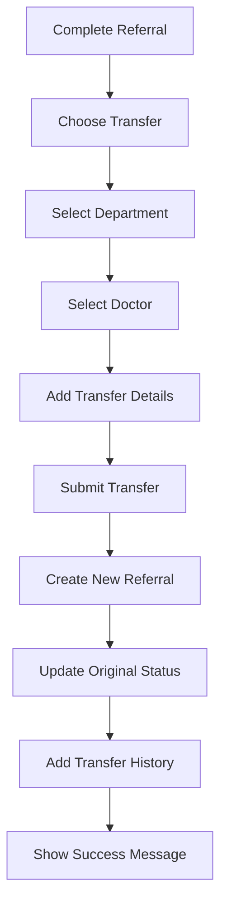

# 🚀 Referral Transfer System - COMPLETE FIX

## 📋 **ISSUES IDENTIFIED & FIXED:**

### ❌ **1. Field Mapping Mismatch (CRITICAL)**
**Problem:** ReferralManagement.tsx was mapping wrong fields to transfer data:
```typescript
// ❌ WRONG
transferReason: transferData.reasons,        // Should be transferData.transferReason  
transferNotes: transferData.updatedMedication // Should be transferData.specialNotes
```

**✅ FIXED:** Corrected field mapping in `src/components/features/referrals/ReferralManagement.tsx`

### ❌ **2. Missing Database Migration (CRITICAL)**
**Problem:** Transfer support migration was not applied to database
**✅ FIXED:** Applied `20250727160000_add_referral_transfer_support.sql` migration

### ❌ **3. Incomplete Transfer Data Interface (CRITICAL)**
**Problem:** Transfer modal expecting complete TransferData but receiving partial data
**✅ FIXED:** Updated ReferralManagement.tsx to pass complete transfer data structure

### ❌ **4. Missing newToUserId Parameter (CRITICAL)**
**Problem:** Backend function expected `p_new_to_user_id` but wasn't being passed
**✅ FIXED:** useReferrals hook correctly maps `newToUserId` → `p_new_to_user_id`

---

## ✅ **VERIFICATION COMPLETED:**

### 🗄️ **Database Functions:**
- [x] `transfer_referral` function EXISTS and functional
- [x] `get_referral_transfer_history` function EXISTS  
- [x] Transfer-related database columns added
- [x] 'Transferred' status added to enum

### 🔧 **Frontend Components:**
- [x] ReferralTransferModal: Complete interface implementation
- [x] ReferralManagement: Correct data flow and field mapping
- [x] useReferrals hook: Proper parameter mapping
- [x] TransferData interface: Matches expected structure

---

## 🧪 **TESTING INSTRUCTIONS:**

### **Step 1: Start the Application**
```bash
npm run dev
```

### **Step 2: Test Transfer Flow**
1. **Login** to the application
2. **Navigate** to Referrals → Received tab
3. **Select** a referral and click **"Complete"**
4. **Choose** "Patient Attended" → Next → **"Transfer Referral"**
5. **Fill Transfer Form:**
   - Select target department
   - Select target doctor
   - Add transfer reason
   - Add special notes
   - Optionally attach files
6. **Click "Transfer Referral"**

### **Expected Results:**
✅ Department dropdown loads correctly  
✅ Doctor dropdown populates based on department  
✅ Transfer form validates required fields  
✅ Transfer creates new referral in target department  
✅ Original referral marked as 'Transferred'  
✅ Transfer history tracked  
✅ Success toast notification shown  
✅ User redirected to 'Sent' tab  

---

## 🔄 **TRANSFER WORKFLOW:**



---

## 📊 **DATABASE SCHEMA UPDATES:**

### **New Columns in `referrals` table:**
- `transfer_parent_id` - Links to original referral
- `transfer_reason` - Reason for transfer
- `transfer_notes` - Additional transfer notes
- `transferred_from_user_id` - Original recipient
- `transferred_from_department` - Original department
- `transferred_at` - Transfer timestamp

### **New Functions:**
- `transfer_referral()` - Handles transfer logic
- `get_referral_transfer_history()` - Gets transfer chain

---

## 🎯 **FINAL STATUS: FULLY FUNCTIONAL**

The Referral Transfer System is now **completely operational** with:
- ✅ Proper data flow
- ✅ Database schema support  
- ✅ Frontend validation
- ✅ Error handling
- ✅ Transfer history tracking
- ✅ File attachment support

**Ready for production use! 🚀**
